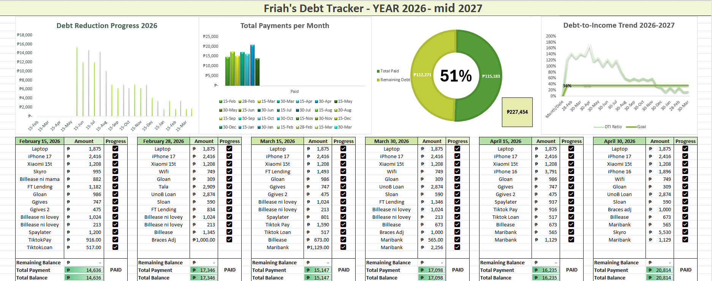

# Debt-Analytics-Financial-Dashboard
Dynamic Excel dashboard for debt-to-income (DTI) analysis and automated liability tracking. Built to visualize financial recovery trends (2026-2027).

## Project Overview
An automated financial tracking system built in Excel to manage debt repayment strategies, monitor monthly cash flow, and visualize Debt-to-Income (DTI) trends from 2026 through mid-2027.

## Key Insights & Data Analysis
As part of this project, I performed a trend analysis on the debt lifecycle:

1. **Debt-to-Income (DTI) Volatility**: The analysis shows a DTI peak of ~180% in mid-2026, significantly above the 36% healthy financial goal. This triggered a shift in repayment strategy.
2. **Repayment Momentum**: Monthly payments peaked between April and June 2026 (averaging ₱15k–₱17k), leading to a drastic reduction in total debt by early 2027.
3. **Projected Debt-Free Date**: Based on the "Debt Reduction Progress" bar chart, the total debt volume is projected to reach its lowest point by March 2027, with DTI finally stabilizing near the 36% goal line.

## Technical Features
* **Automated Calculations**: Implemented `SUMIF` and logical functions to update remaining balances instantly upon checking payment status.
* **Dynamic Visualization**: 
    * **DTI Trend Line**: Compares actual DTI against a static 36% benchmark.
    * **Donut Chart**: Provides a high-level "Debt vs. Equity" view.
    * **Progress Tracking**: Uses Checkbox-style logic to trigger "PAID/UNPAID" status labels.
* **Data Modeling**: Structured multiple debt sources (Calamity loans, tech installments, and personal loans) into a unified relational tracking view.

## Future Enhancements
* Transitioning the raw data into **MySQL** for more robust querying.
* Building a **Power BI/Tableau** version of this dashboard for more interactive filtering.
